

  

<!-- <h2>Project Management Tool</h2> -->

  <b>A modern, visually rich Kanban-style project management tool inspired by Trello.</b>

  TaskDeck is designed to streamline workflow management through an intuitive drag-and-drop interface, 
  enabling users to organize tasks across boards, lists, and cards with complete flexibility.

 

  🌐 <b>Live Demo:</b>  
  <a href="https://taskflow-6yph.onrender.com/" target="_blank">
    https://taskflow-6yph.onrender.com/
  </a>

 

  ✨ <b>Why TaskDeck?</b> 
  → Simplifies project tracking with a clean and responsive UI 
  → Enables real-time task organization with smooth drag & drop 
  → Provides powerful card-level customization (labels, due dates, members) 

  ⚡ <b>Core Experience</b> 
  Experience seamless movement of tasks across workflows, just like Trello — but built from scratch 
  with a focus on performance, scalability, and clean architecture.

 

## 🛠️ Tech Stack

### 🎨 Frontend
- React.js (Single Page Application)
- Tailwind CSS (Utility-first styling)
- Axios (API communication)

### ⚙️ Backend
- Node.js
- Express.js (RESTful API architecture)

### 🗄️ Database
- MongoDB (NoSQL database)
- Mongoose (ODM for schema modeling)

### ☁️ Deployment
- Frontend: Render
- Backend: Render

 

## ✅ Features

- Board creation and management  
- List creation, deletion, and reordering  
- Card CRUD operations  
- Drag and drop (within & across lists)  
- Labels, due dates, members, attachments  
- Search across boards  
- List-level filtering  
- Multi-board workspace  

## 🗄️ Database Design

- User → stores user information  
- Board → contains multiple lists  
- List → contains multiple cards  
- Card → stores task details, labels, members, due dates  

## 🖥️ Application Overview

  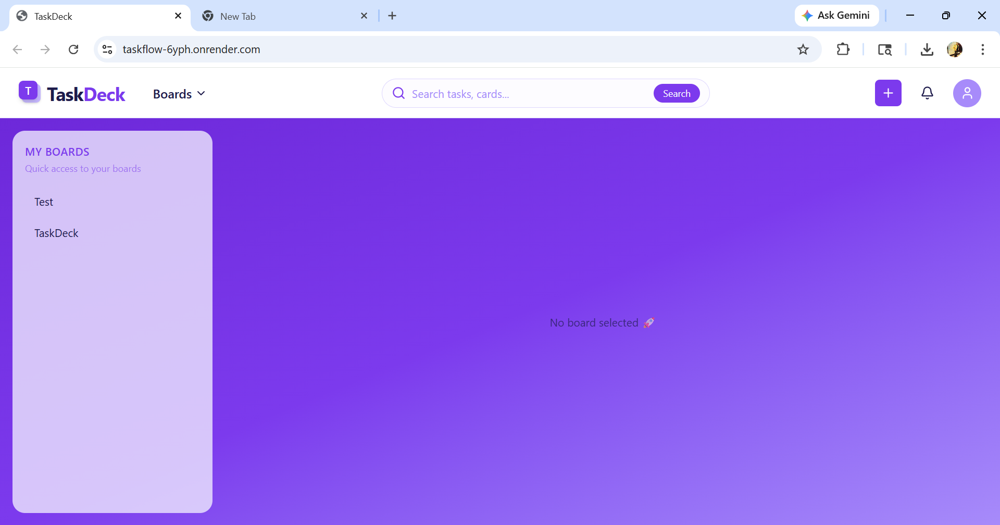

## ➕ Creating a New Board

To start managing your tasks, you first need to create a board.

### 🧭 Steps to Create a Board:

1. **Navigate to the Navbar**
   - Click on the **“Boards”** option in the top navigation bar.

2. **Open the Dropdown Menu**
   - A dropdown menu will appear showing available options.

3. **Select “Create New Board”**
   - Click on the **“Create New Board”** option from the dropdown.

4. **Board Creation Dialog**
   - A dialog box will open in the workspace.
   - Enter the required details (such as board title).

5. **Create the Board**
   - Submit the form to create your new board.

 

  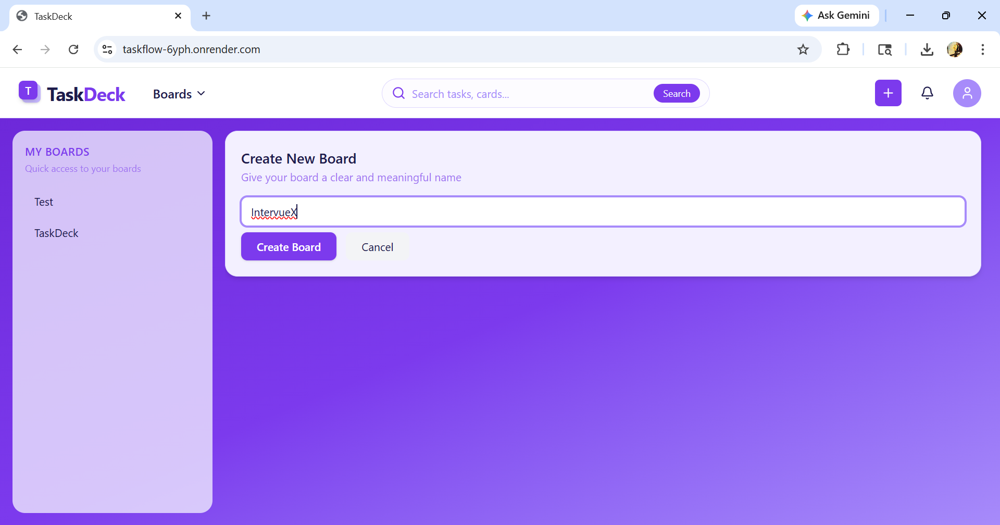

## 📌 After Creating a Board

Once a board is created, it becomes immediately available in the sidebar under **“My Boards”**.

### 🧩 What happens next:

- The selected board opens in the main workspace
- You are provided with **default lists**:
  - **Todo**
  - **In Progress**
  - **Done**

### ➕ List Management

- You can add new lists using the **“+ Add another list”** option
- Each list represents a stage in your workflow

### 🔄 Horizontal Scrolling

- The board supports **horizontal scrolling**, allowing you to manage multiple lists smoothly
- This ensures scalability as your project grows

  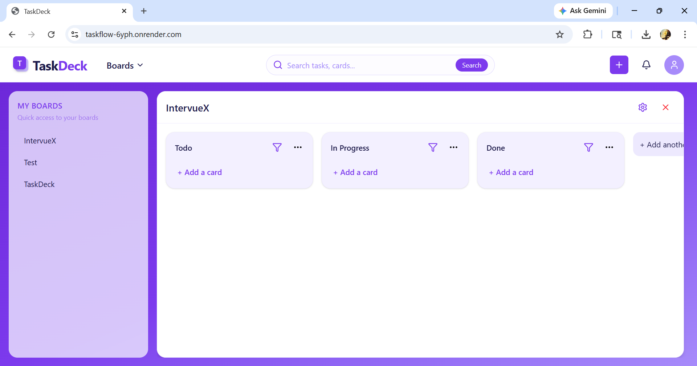
   

## 📝 Managing Cards

Cards represent individual tasks within a list and can be easily created and managed.

### ➕ Creating a Card
- Click on **“+ Add a card”** inside any list
- Enter the card title
- Confirm to add the card to the list

### Each card supports full CRUD functionality:

- **Create** → Add new cards to any list  
- **Read** → View card details  
- **Update** → Edit card title and details  
- **Delete / Archive** → Access options from the **three-dot menu (⋯)** on the card  

### ✅ Marking Task as Completed

- On hovering over a card, a **checkbox appears**
- Click the checkbox to mark the task as completed
- Completed tasks are visually distinguished (e.g., faded or struck-through)

  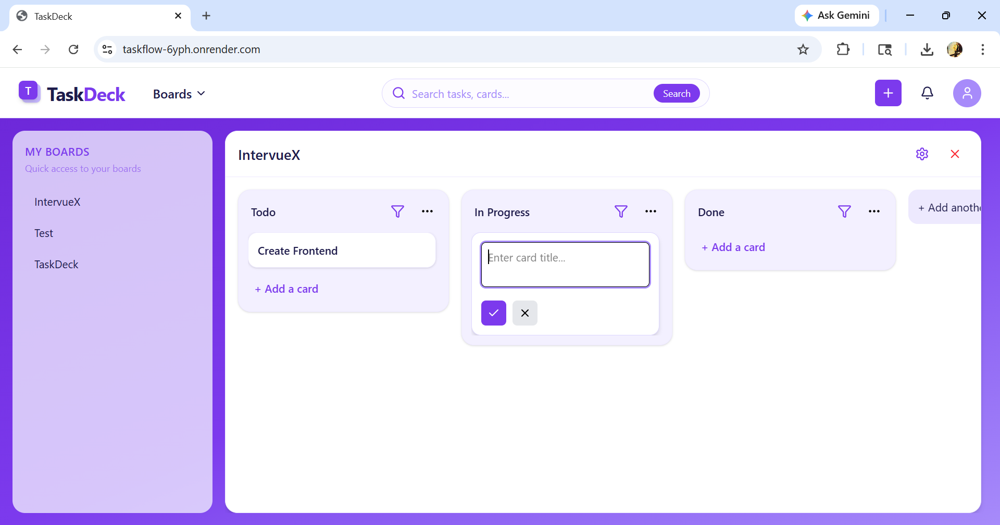
  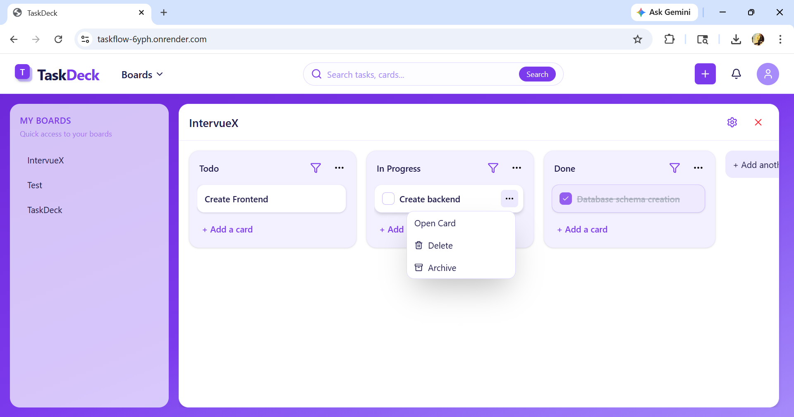
  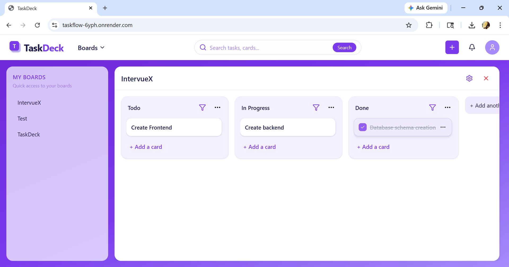

## 📄 Card Details & Editing

To view or edit a card in detail:

### 🧭 How to Open a Card
- Click directly on any card  
  **OR**
- Click on the **three-dot menu (⋯)** and select **“Open Card”**

### 📝 Card Detail Modal

Once opened, a modal dialog appears where you can manage complete card information:

- **Title & Description** → Add or update detailed task information  
- **Due Date** → Set deadlines for tasks  
- **Status** → Toggle between different states (e.g., pending/completed)  
- **Labels** → Assign colored tags for categorization  
- **Members** → Add users to the card  
- **Attachments** → Upload files related to the task 

  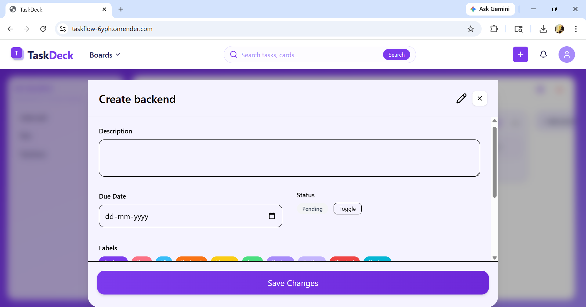
  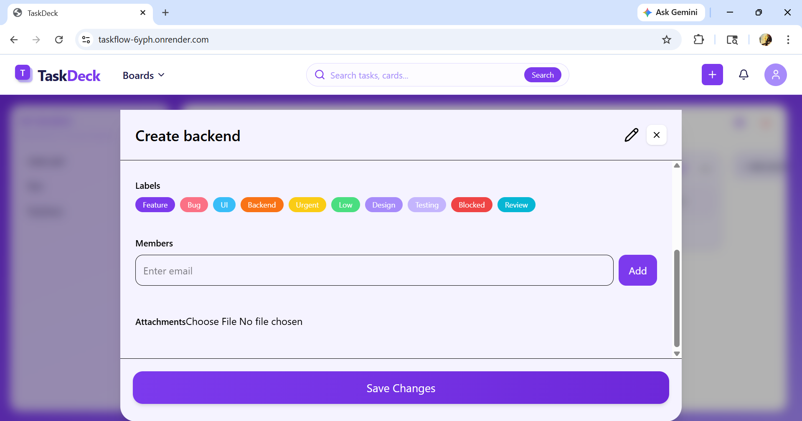

## 📑 List Controls & Filtering

Each list provides additional controls to manage workflow efficiently.

### ⚙️ List Actions

- Click on the **three-dot menu (⋯)** on a list to access options:
  - **Edit** → Rename the list
  - **Delete** → Remove the entire list along with its cards

### 🔍 Card Filtering System

Each list includes a built-in filtering feature to quickly find relevant tasks.

#### 📌 Filter Options:

- **Status Filter**
  - View **All**, **Completed**, or **Incomplete** cards

- **Member Filter**
  - Filter cards assigned to a specific member using email

- **Due Date Filter**
  - Show cards based on selected deadlines

- **Label Filter**
  - Filter cards using colored labels (e.g., Bug, Feature, Urgent)

  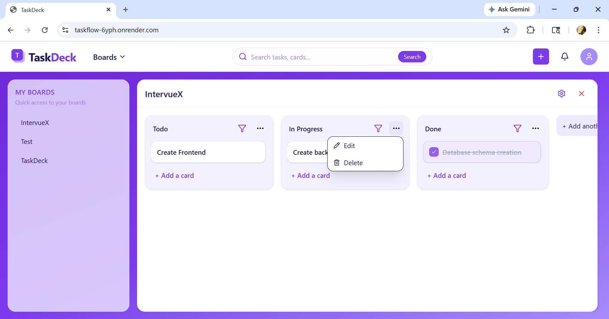
  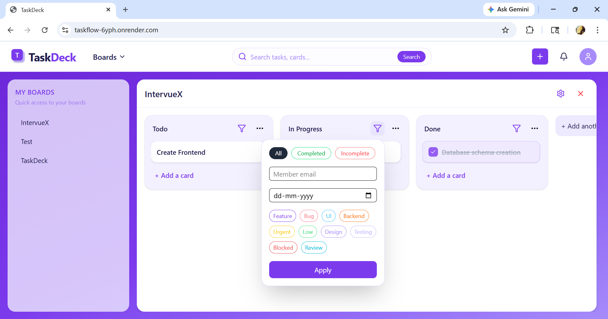

## 🗂️ Multiple Board Management

TaskDeck allows users to work with **multiple boards simultaneously**, improving productivity and multitasking.

### 🔄 Switching Between Boards

- Select any board from the **sidebar under "My Boards"**
- The selected board opens in the workspace
- The **most recently selected board appears at the top**

### 📌 Active Board Behavior

- Multiple boards can remain open at the same time
- Boards are stacked vertically in the workspace
- The latest active board is prioritized for quick access

### ❌ Closing a Board

- Each board has a **close (✖) icon**
- Click on the icon to remove the board from the workspace
- This does not delete the board, only removes it from view

  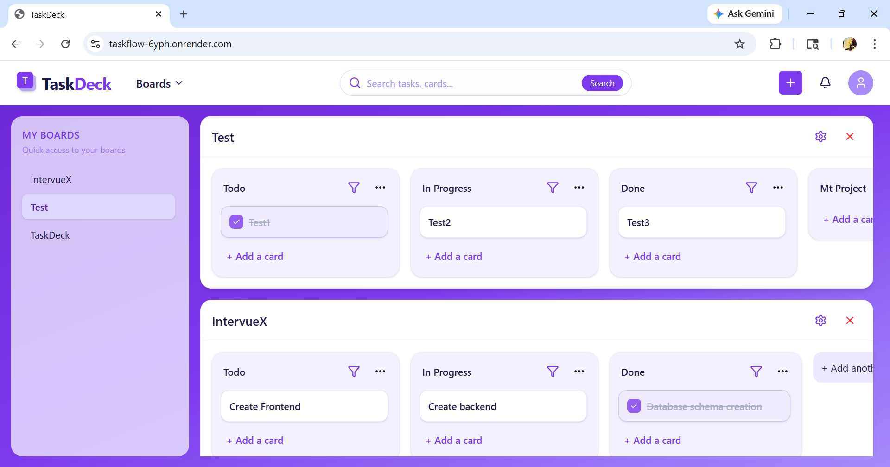

## 🔍 Global Search Functionality

TaskDeck provides a powerful **global search feature** to quickly locate cards across all boards.

### 🔎 How Search Works

- Use the **search bar in the top navigation**
- Enter the name (or keyword) of the card
- Click on the **Search** button

### 📋 Search Results

- A dropdown list of matching cards is displayed
- Each result includes:
  - **Card Title**
  - **Board Name**
  - **List Name**

This helps users easily identify where the card belongs.

### ⚡ Key Benefits

- Quickly find tasks across multiple boards  
- Saves time when working on large projects  
- Improves navigation and productivity 

  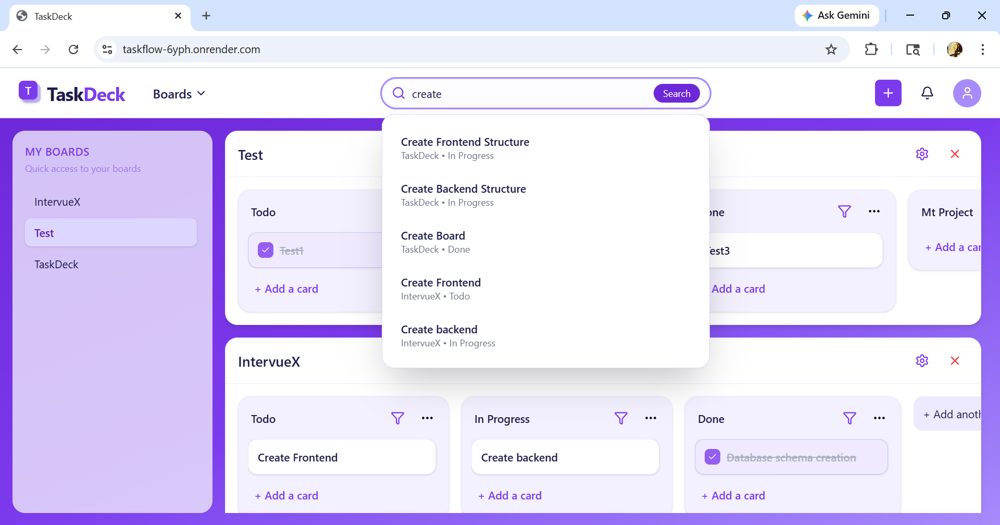

## 🔄 Drag & Drop Functionality

TaskDeck implements a fast and intuitive **drag-and-drop system** that allows users to manage tasks seamlessly across lists.

### 🧭 Supported Interactions

#### 🔹 Reordering Within the Same List
- Users can drag a card and reposition it within the same list  
- The updated order is reflected instantly  

#### 🔹 Moving Cards Across Lists
- Cards can be dragged from one list to another  
- Enables smooth workflow transitions (e.g., Todo → In Progress → Done)

### ⚡ Performance & Experience

- Drag-and-drop interactions are **highly responsive**
- UI updates occur in **milliseconds**
- No page reload is required — everything happens in real-time
- Smooth visual feedback enhances usability

### 🧠 Implementation Insight

- Built using a modern drag-and-drop approach (e.g., **dnd-kit**)  
- State updates are handled **optimistically**, ensuring instant UI response  
- Backend sync ensures data consistency after each operation  

### 💡 Why This Feature Matters

- Makes task management **interactive and intuitive**  
- Improves productivity by reducing manual effort  
- Closely replicates real-world Kanban tools like Trello  

  

## ⚙️ Assumptions

To simplify the implementation and focus on core functionality, the following assumptions were made:

### 👤 Default User System

- No authentication system is implemented  
- The application assumes a **default logged-in user**

👉 **Default User:**
- **Name:** Rahul Sharma  
- **Email:** rahul@test.com  
- This user is marked as the primary user (`isDefault: true`)

### 👥 Sample Users (For Assignment & Testing)

The system is pre-seeded with sample users to support features like assigning members to cards.

| Name          | Email             |
|--------------|------------------|
| Rahul Sharma | rahul@test.com   |
| Priya Verma  | priya@test.com   |
| Aman Singh   | aman@test.com    |
| Neha Gupta   | neha@test.com    |
| Arjun Mehta  | arjun@test.com   |

### 🧪 Purpose of Sample Data

- Enables **member assignment feature**
- Helps demonstrate **real-world collaboration scenarios**
- Removes dependency on authentication for this assignment

 

  <i>“Organize smarter. Move faster. Build better.”</i>

